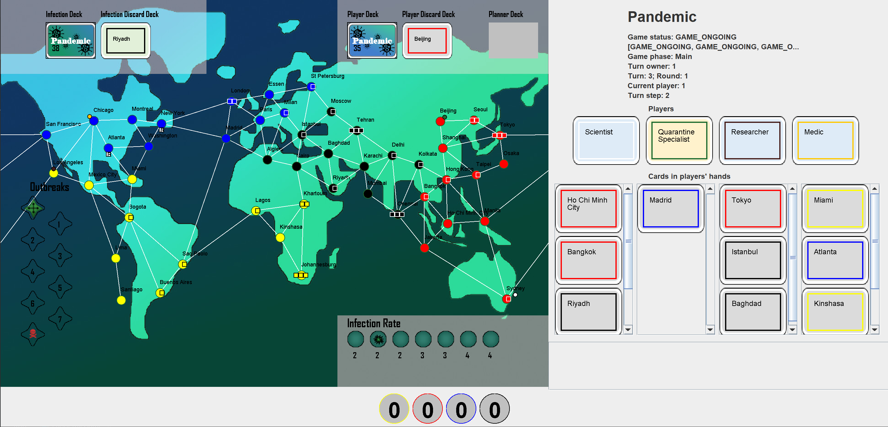

# TAG: [Tabletop Games Framework](http://www.tabletopgames.ai/)

[](LICENSE)


[](https://twitter.com/intent/follow?screen_name=gameai_qmul)
[](https://github.com/GAIGResearch/TabletopGames)

The [Tabletop Games Framework (TAG)](http://tabletopgames.ai) is a Java-based benchmark for developing modern board games for AI research.  TAG provides a common skeleton for implementing tabletop games based on a common API for AI agents, a set of components and classes to easily add new games and an import module for defining data in JSON format. At present, this platform includes the implementation of seven different tabletop games that can also be used as an example for further developments. Additionally, TAG also incorporates logging functionality that allows the user to perform a detailed analysis of the game, in terms of action space, branching factor, hidden information, and other measures of interest for Game AI research.

*Example GUI for Pandemic*

## Games
Currently implemented games:
- [x] Battlelore: Second Edition (Richard Borg and Robert A Kouba, 2013)
- [x] Blackjack (Uncredited, circa 1700)
- [x] Can't Stop (Sid Sackson, 1980)
- [x] Colt Express (Christophe Raimbault, 2014)
- [x] Connect 4 (Ned Strongin and Howard Wexler, 1974)
- [x] Diamant (Bruno Faidutti and Alan R. Moon, 2005)
- [x] Dominion (Donald X. Vaccarino, 2008)
- [x] Dots and Boxes (Edouard Lucas, 1889)
- [x] Exploding Kittens (Inman and others, 2015)
- [x] Love Letter (Seiji Kanai, 2012)
- [x] Pandemic (Matt Leacock, 2008)
- [x] Poker Texas Hold'em (Uncredited, 1810)
- [x] Settlers of Catan (Klaus Teuber, 2008)
- [x] Stratego (Jacques Johan Mogendorff, 1946)
- [x] Terraforming Mars (Jacob Fryxelius, 2016)
- [x] Tic-Tac-Toe (Uncredited, Unknown)
- [x] Uno (Merle Robbins, 1971)
- [x] Virus! (Cabrero and others, 2015)

Games in progress:
- [ ] Descent (Jesper Ejsing, John Goodenough, Frank Walls 2005)
- [ ] Hanabi (Antoine Bauza 2010)
- [ ] 7 Wonders (Antoine Bauza 2010)

## Setting up
The project requires Java with minimum version 8. In order to run the code, you must either download the repository, or clone it. If you are looking for a particular release, you can find all listed [here](https://github.com/GAIGResearch/TabletopGames/releases). 

The simplest way to run the code is to create a new project in [IntelliJ IDEA](https://www.jetbrains.com/idea/) or a similar IDE. In IntelliJ, create a new project from existing sources, pointing to the code downloaded or cloned and selecting the **Maven** framework for import. This process should automatically set up the environment and add any project libraries as well.

Alternatively, open the code directly in your IDE of choice, right click the pom.xml file and setup the project with the Maven framework. Make sure src/main/java is marked as sources root. You can run the `core.Game.java` class to test if all is set up properly and compiling. [This video](https://youtu.be/-U7SCGNOcsg) includes the steps of loading the project correctly in IntelliJ.

## Getting started

To get started the [website](http://tabletopgames.ai) provides various guides and descriptions of the framework.
Another good resource is our paper ["Design and Implementation of TAG: A Tabletop Games Framework"](https://arxiv.org/abs/2009.12065).

## Citing Information

To cite TAG in your work, please cite this paper:
```
@inproceedings{gaina2020tag,
         author= {Raluca D. Gaina and Martin Balla and Alexander Dockhorn and Raul Montoliu and Diego Perez-Liebana},
         title= {{TAG: A Tabletop Games Framework}},
         year= {2020},
         booktitle= {{Experimental AI in Games (EXAG), AIIDE 2020 Workshop}},
         abstract= {Tabletop games come in a variety of forms, including board games, card games, and dice games. In recent years, their complexity has considerably increased, with many components, rules that change dynamically through the game, diverse player roles, and a series of control parameters that influence a game's balance. As such, they also encompass novel and intricate challenges for Artificial Intelligence methods, yet research largely focuses on classical board games such as chess and Go. We introduce in this work the Tabletop Games (TAG) framework, which promotes research into general AI in modern tabletop games, facilitating the implementation of new games and AI players, while providing analytics to capture the complexities of the challenges proposed. We include preliminary results with sample AI players, showing some moderate success, with plenty of room for improvement, and discuss further developments and new research directions.},
    }
```

## Other Materials

### Visual materials
V1 – Edited programming video (see below)<br/>
V2 – Uncut programming video (see below)<br/>
V3 – PowerPoint slides: https://tinyurl.com/tag-exag-ppt <br/>
V5 – Transcript A1: https://tinyurl.com/tag-exag-tr1 <br/>
V6 – Transcript A2: https://tinyurl.com/tag-exag-tr2 <br/>

### Audio materials
A1 – Framework presentation (see below)<br/>
A2 – Programming (see below)<br/>

### Full videos available
EXAG 2020 presentation (A1 + V1): https://youtu.be/M81elk-NmKM<br/>
EXAG alternative presentation (A1 + V3): https://youtu.be/ST_2Q40pzjc<br/>
TAG introduction tutorial (A2 + V1): https://youtu.be/-U7SCGNOcsg<br/>
TAG full programming tutorial (V2): https://youtu.be/m7DAFdViywY <br/>

## Contact
The main method to contribute to our repository directly with code, or to suggest new features, point out bugs or ask questions about the project is through [creating new Issues on this github repository](https://github.com/GAIGResearch/TabletopGames/issues) or [creating new Pull Requests](https://github.com/GAIGResearch/TabletopGames/pulls). Alternatively, you may contact the authors of the papers listed above. 

You can also find out more about the [QMUL Game AI Group](http://gameai.eecs.qmul.ac.uk/).

## Acknowledgements

This work was partly funded by the EPSRC CDT in Intelligent Games and Game Intelligence (IGGI)  EP/L015846/1 and EPSRC research grant EP/T008962/1.
