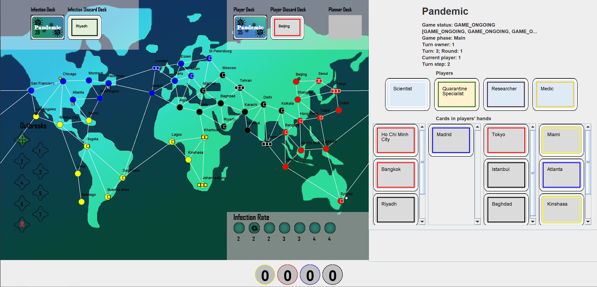

# TAG: [Tabletop Games Framework](http://www.tabletopgames.ai/)

[](LICENSE)


[](https://twitter.com/intent/follow?screen_name=gameai_qmul)
[](https://github.com/GAIGResearch/TabletopGames)

The [Tabletop Games Framework (TAG)](http://tabletopgames.ai) is a Java-based benchmark for developing modern board games for AI research.  TAG provides a common skeleton for implementing tabletop games based on a common API for AI agents, a set of components and classes to easily add new games and an import module for defining data in JSON format. At present, this platform includes the implementation of seven different tabletop games that can also be used as an example for further developments. Additionally, TAG also incorporates logging functionality that allows the user to perform a detailed analysis of the game, in terms of action space, branching factor, hidden information, and other measures of interest for Game AI research.

*Example GUI for Pandemic*

## Games
For a full list of currently implemented games, see the website maintained at [http://tabletopgames.ai](http://tabletopgames.ai).


## Setting up
The project requires Java with minimum version 21. In order to run the code, you must either download the repository, or clone it. If you are looking for a particular release, you can find all listed [here](https://github.com/GAIGResearch/TabletopGames/releases). 

The simplest way to run the code is to create a new project in [IntelliJ IDEA](https://www.jetbrains.com/idea/) or a similar IDE. In IntelliJ, create a new project from existing sources, pointing to the code downloaded or cloned and selecting the **Maven** framework for import. This process should automatically set up the environment and add any project libraries as well.

Alternatively, open the code directly in your IDE of choice, right click the pom.xml file and setup the project with the Maven framework. Make sure src/main/java is marked as sources root. You can run the `core.Game.java` class to test if all is set up properly and compiling. [This video](https://youtu.be/-U7SCGNOcsg) includes the steps of loading the project correctly in IntelliJ.

## Getting started

To get started the [website](http://tabletopgames.ai) provides various guides and descriptions of the framework, plus links to key research papers that have used TAG.
Another good resource is our paper ["Design and Implementation of TAG: A Tabletop Games Framework"](https://arxiv.org/abs/2009.12065).

## Playing in a browser

The `WebServer` entry point serves games to a web browser, so that someone can play against TAG's AI agents from a
link. The game, its AI players and its usual Swing GUI all run on the server; the GUI is streamed to the page, which
sends the mouse and keyboard back, and shows the game's actions, information and history natively alongside it. A start
page sets up a game (players, seat, an opponent per seat, seed and the game's parameters); the game page's address holds
that setup, so it can be bookmarked or shared. The game page can download a log of the game (its setup, seed and moves)
and, if the setup asks for it, shows what the AI players weighed up for each decision (which reveals what they know).

The page also:

- groups a long list of actions by kind, and numbers the first nine for the keys 1 to 9;
- shows a scoreboard (whose turn, and the scores where the GUI shows them) and the history with the players' names, and
  when it becomes your turn, what the other players did since your last move (with a sound if the tab is in the
  background; the bell button switches it off);
- fits the game to the window, centred (enlarging a small GUI as well as shrinking a large one), or zooms it to the
  player's choice (the − Fit + buttons, the mouse wheel, or a pinch), drawing it again at the new size rather than
  magnifying the image. Zoomed in beyond the window, the view is moved by dragging with the right or middle button,
  or on the space around the game, or with two fingers. Over a part of a game that scrolls with the wheel itself, the
  wheel scrolls it (Ctrl and the wheel always zoom). The zoom is kept for each game, and the side panel can be hidden
  to give the game the whole width;
- shows the game's rules as a web page beside the game (the Rules button), taking the GUI's rules tabs out of the
  streamed image. A game's rules are written in Markdown, in `data/rules/<GameType>/` (one file for each page, filled
  in from the game's parameters; see `gui.RulesPages`), and the desktop GUI shows the same files in its tabs;
- works by touch: a tap clicks, a long press is the right button, a drag drags, and two fingers zoom and pan;
- reconnects to the same game when the connection drops (a phone asleep, a network change) or the page is reloaded;
- outlines and answers clicks on the parts of the board a GUI offers as click regions (see
  `AbstractGUIManager.getClickRegions`; Go Fish and Hearts do), without waiting for the image, with a menu
  when a click there could mean several actions;
- on a board that is a map (`AbstractGUIManager.getMapRegions` and `getMapMove`; Diplomacy, Risk and Pandemic), lets
  the player point at a piece and then at where it goes: the piece's choices are outlined and listed, and a menu offers
  them when there are several; the action list is grouped by piece. A choice that follows one made on the map (the
  dice for an attack, the armies to move) is offered in a menu where the player clicked;
- lets the player plan several decisions and send them together, where the game offers a planner
  (`AbstractGUIManager.getPlanner`, `gui.IMovePlanner`): Diplomacy's orders, in any order, each changeable, with
  warnings such as a support for a move not ordered; Risk's reinforcements; the actions of a Pandemic turn. The board
  shows the planned state; nothing is sent until the player presses the button.

```bash
java -jar target/TAG.jar WebServer token=some-long-secret
# then open http://localhost:8080/?token=some-long-secret
```

Arguments (all optional): `port` (8080); `games`, a comma-separated list of the games to offer (e.g.
`games=LawnAndOrder`), or `all` (the default) for every game with a GUI; `agents`, the directory of agent JSON files
to offer as opponents (`json/players/webserver`, which has random, one-step look-ahead and MCTS at 0.1, 1 and 5
seconds per decision; any in `data/<game>/agents` are offered too); `token`, a secret every visitor needs, given once
in the link and then kept in a cookie (without it the server is open to anyone who can reach it); `maxSessions` (3),
the most games played at once; `idleMinutes` (30), after which a game left alone is ended; `resumeMinutes` (10), how
long a game waits for its page to reconnect (a game waiting counts towards `maxSessions`, but the one waiting longest
makes way for a new game); `lookAndFeel` (`flat` or `default`).

An agent file is any player definition `PlayerFactory` reads (`json/players` has examples). Its file name, less
`.json`, is the agent's name on the start page and in the game. It may also have a `label`, a description shown after
the name, and `"default": true` to make it the opponent chosen when a setup names none (otherwise the first is):

```json
{
  "label": "MCTS, 1 s per decision",
  "default": true,
  "class": "players.mcts.MCTSParams",
  "budgetType": "BUDGET_TIME",
  "budget": 1000
}
```

With Docker, the image runs every entry point under a virtual display, so the web server works without a screen:

```bash
docker build -t tag .
docker run -p 8080:8080 --cpus=2 --memory=4g tag WebServer token=some-long-secret
```

Games are held in memory, so run a single instance that is not scaled to zero. Limit its CPU: MCTS opponents use all
the time they are given, in every game being played. To share a server running on your own machine, a tunnel such as
`cloudflared tunnel --url http://localhost:8080` gives a public address; Cloudflare Access can add a login in front of
it.

## Citing Information

To cite TAG in your work, please cite this paper:
```
@inproceedings{gaina2020tag,
         author= {Raluca D. Gaina and Martin Balla and Alexander Dockhorn and Raul Montoliu and Diego Perez-Liebana},
         title= {{TAG: A Tabletop Games Framework}},
         year= {2020},
         booktitle= {{Experimental AI in Games (EXAG), AIIDE 2020 Workshop}},
         abstract= {Tabletop games come in a variety of forms, including board games, card games, and dice games. In recent years, their complexity has considerably increased, with many components, rules that change dynamically through the game, diverse player roles, and a series of control parameters that influence a game's balance. As such, they also encompass novel and intricate challenges for Artificial Intelligence methods, yet research largely focuses on classical board games such as chess and Go. We introduce in this work the Tabletop Games (TAG) framework, which promotes research into general AI in modern tabletop games, facilitating the implementation of new games and AI players, while providing analytics to capture the complexities of the challenges proposed. We include preliminary results with sample AI players, showing some moderate success, with plenty of room for improvement, and discuss further developments and new research directions.},
    }
```

## Contact
The main method to contribute to our repository directly with code, or to suggest new features, point out bugs or ask questions about the project is through [creating new Issues on this github repository](https://github.com/GAIGResearch/TabletopGames/issues) or [creating new Pull Requests](https://github.com/GAIGResearch/TabletopGames/pulls). Alternatively, you may contact the authors of the papers listed above. 

You can also find out more about the [QMUL Game AI Group](http://gameai.eecs.qmul.ac.uk/).

## Acknowledgements

This work was partly funded by the EPSRC CDT in Intelligent Games and Game Intelligence (IGGI)  EP/L015846/1 and EPSRC research grant EP/T008962/1.
